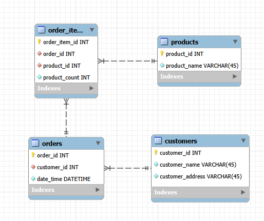
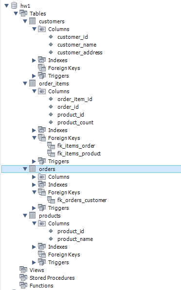

# goit-rdb-hw-02

Нормалізація таблиці замовлень до 1НФ, 2НФ, 3НФ.

## Файли

- [normalization.md](normalization.md) — нормалізація 1НФ → 2НФ → 3НФ

## ER-діаграма

## Схема таблиць у MySQL Workbench

